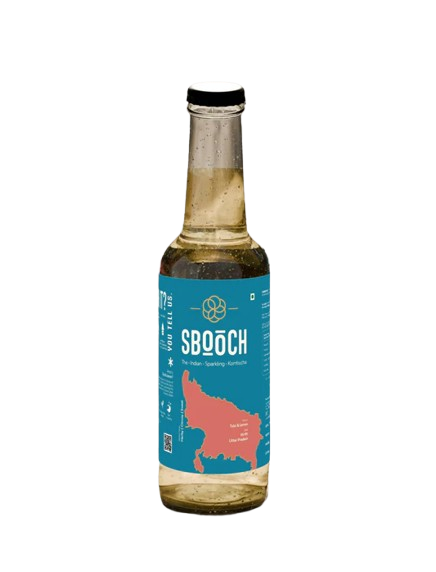

# SBOOCH – Kombucha Brand Landing Page

<p align="center">
  
</p>

<p align="center">
  <strong>A premium, scroll-driven landing page for a modern Kombucha beverage brand.</strong>
</p>

<p align="center">
  <a href="#features">Features</a> •
  <a href="#demo">Demo</a> •
  <a href="#tech-stack">Tech Stack</a> •
  <a href="#getting-started">Getting Started</a> •
  <a href="#project-structure">Project Structure</a> •
  <a href="#license">License</a>
</p>

---

## ✨ Features

- **Immersive Scroll Animations** – Smooth, scroll-triggered animations powered by GSAP & ScrollTrigger
- **Dynamic Product Showcase** – Interactive bottle transitions with parallax effects
- **Responsive Design** – Fully optimized for desktop, tablet, and mobile devices
- **Modern UI/UX** – Clean, minimalist aesthetic with elegant typography
- **Performance Optimized** – Next.js Image optimization & lazy loading
- **Smooth Scrolling** – Lenis integration for buttery-smooth scroll experience

## 🎬 Demo

> Add your live demo link here once deployed

```
https://your-demo-url.vercel.app
```

## 🛠 Tech Stack

| Technology | Purpose |
|------------|---------|
| [Next.js 16](https://nextjs.org/) | React framework with App Router |
| [React 19](https://react.dev/) | UI library |
| [Tailwind CSS 4](https://tailwindcss.com/) | Utility-first styling |
| [GSAP](https://gsap.com/) | Animation library |
| [ScrollTrigger](https://gsap.com/docs/v3/Plugins/ScrollTrigger/) | Scroll-based animations |
| [Lenis](https://github.com/studio-freight/lenis) | Smooth scroll |

## 🚀 Getting Started

### Prerequisites

- Node.js 18.x or higher
- npm, yarn, or pnpm

### Installation

1. **Clone the repository**

   ```bash
   git clone https://github.com/your-username/flux-ui.git
   cd flux-ui
   ```

2. **Install dependencies**

   ```bash
   npm install
   # or
   yarn install
   # or
   pnpm install
   ```

3. **Run the development server**

   ```bash
   npm run dev
   # or
   yarn dev
   # or
   pnpm dev
   ```

4. **Open your browser**

   Navigate to [http://localhost:3000](http://localhost:3000)

### Build for Production

```bash
npm run build
npm start
```

## 📁 Project Structure

```
flux-ui/
├── app/
│   ├── globals.css       # Global styles & Tailwind imports
│   ├── layout.jsx        # Root layout component
│   └── page.jsx          # Home page
├── components/
│   ├── Hero.jsx          # Main hero section with animations
│   └── heroAnimations.js # GSAP animation logic
├── fonts/                # Custom fonts
├── public/               # Static assets (images, icons)
├── eslint.config.mjs     # ESLint configuration
├── next.config.mjs       # Next.js configuration
├── postcss.config.mjs    # PostCSS configuration
├── tailwind.config.js    # Tailwind CSS configuration
└── package.json
```

## 🎨 Key Components

### Hero Section
The main landing section featuring:
- Animated bottle transitions between product variants
- Crossfading background images
- Scroll-driven text animations
- Rotating product showcase

### Grid Section
An interactive product grid displaying:
- 6-column layout with alternating scroll directions
- Typography spelling "SBOOCH"
- Parallax bottle images
- Fade-out animations on scroll

## ⚙️ Configuration

### Environment Variables

Create a `.env.local` file if needed:

```env
# Add your environment variables here
NEXT_PUBLIC_SITE_URL=http://localhost:3000
```

### Customization

- **Colors**: Modify `app/globals.css` or Tailwind config
- **Animations**: Adjust timing/easing in `components/heroAnimations.js`
- **Content**: Update text in `components/Hero.jsx`

## 📱 Responsive Breakpoints

| Breakpoint | Screen Size |
|------------|-------------|
| `sm` | 640px+ |
| `md` | 768px+ |
| `lg` | 1024px+ |
| `xl` | 1280px+ |

## 🤝 Contributing

Contributions are welcome! Please follow these steps:

1. Fork the repository
2. Create a feature branch (`git checkout -b feature/amazing-feature`)
3. Commit your changes (`git commit -m 'Add amazing feature'`)
4. Push to the branch (`git push origin feature/amazing-feature`)
5. Open a Pull Request

## 📄 License

This project is licensed under the MIT License - see the [LICENSE](LICENSE) file for details.

## 👤 Author

**Your Name**

- GitHub: [@your-username](https://github.com/your-username)
- LinkedIn: [Your Name](https://linkedin.com/in/your-profile)

---

<p align="center">
  Made with ❤️ and lots of Kombucha 🍵
</p>
